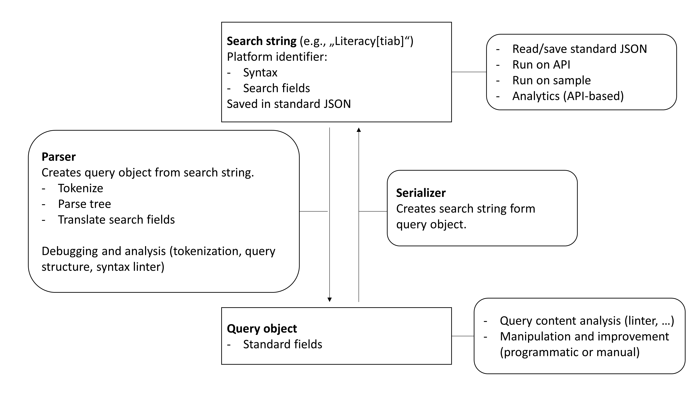

# Search-query docs

TODO :

- summarize the parser (https://en.wikipedia.org/wiki/Parsing) and distinguish from serializer
- clarify processes (source string, ...different syntaxes, query object)
- distinguish DB Syntax from "Standard syntax" (internal)
- connection to standard JSON search-file
- database syntax identifiers
- Instructions on how to run queries

- Tests (all test data should be stored in standard JSON)

## Translate search fields: Mapping of DB-Fields to Standard-Fields

The search fields supported by the database (**DB-Fields**) may not necessarily match exactly with the standard fields (**Standard-Fields**) in `constants.Fields`.

We distinguish the following cases:

1. 1:1 matches

Cases where a 1:1 match exists between DB-Fields and Standard-Fields are added to the `constants.SYNTAX_FIELD_MAP`.

2. 1:n matches

Cases where a DB-Field combines multiple Standard-Fields are added to the `constants.SYNTAX_COMBINED_FIELDS_MAP`. For example, Pubmed offers a search for `[tiab]`, which combines Fields.TITLE and Fields.ABSTRACT.

When parsing combined DB-Fields, the standard syntax should consist of n nodes, each with the same search term and an atomic Standard-Field. For example, `Literacy[tiab]` should become `(Literacy[ti] OR Literacy[ab])`. When searializing a database string, it is recommended to combine Standard-Fields into DB-Fields whenever possible.

3. n:1 matches

If multiple Database-Fields correspond to the same Standard-Field, a combination of the default Database-Field and Standard-Field are added to the `constants.SYNTAX_FIELD_MAP`. Non-default Database-Fields are replaced by the parser. For example, the default for MeSH terms at Pubmed is `[mh]`, but the parser also supports `[mesh]`.
