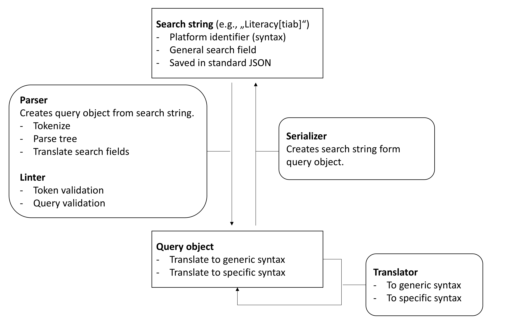

Overview
==========================

To support a platform, a parser, linter, translator, and serializer are required.
The parser is responsible for parsing the search string, while the linter checks the parsed query for errors.
The serializer converts the parsed query back into a search string.

Development setup
-------------------

.. code-block::
   :caption: Installation in editable mode with `dev` extras

   pip install -e ".[dev]"

Repository layout
-----------------

Versioned implementations live inside
``search_query/<platform>/vX_Y_Z/`` directories:

.. code-block:: text

   search_query/
       pubmed/
           v1_0_0/
               parser.py
               serializer.py

To add a new parser or serializer version:

1. copy the latest versioned directory (e.g. ``v1_0_0`` → ``v1_1_0``),
2. apply your changes,
3. register the new version in ``search_query.parser.PARSERS`` or
   ``search_query.serializer.SERIALIZERS`` so it becomes discoverable.

A code skeleton is available for the parser, linter, translator, and tests.
