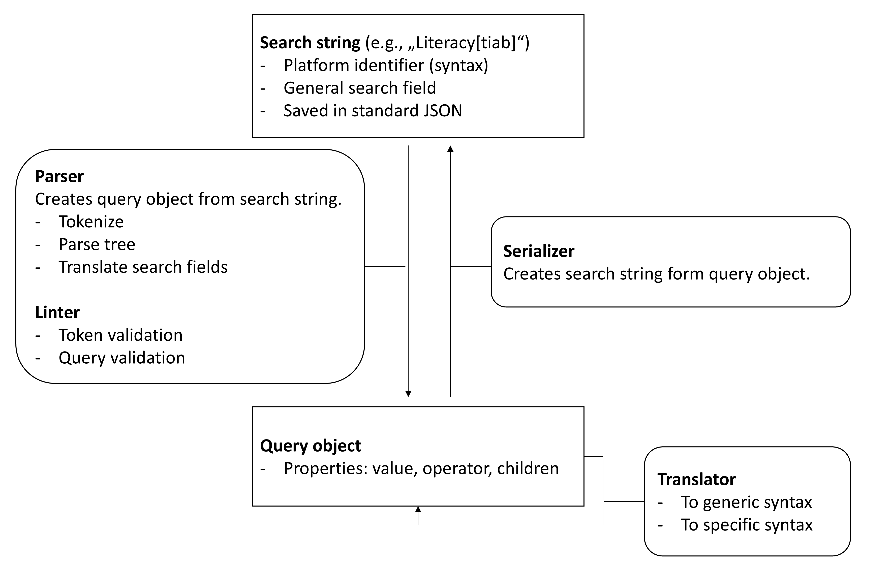

Overview
==========================

To support a platform, a parser, linter, translator, and serializer are required.
The parser is responsible for parsing the search string, while the linter checks the parsed query for errors.
The serializer converts the parsed query back into a search string.

Development setup
-------------------

.. code-block::
   :caption: Installation in editable mode with `dev` extras

   pip install -e ".[dev]"

A code skeleton is available for the parser, linter, translator, and tests.
