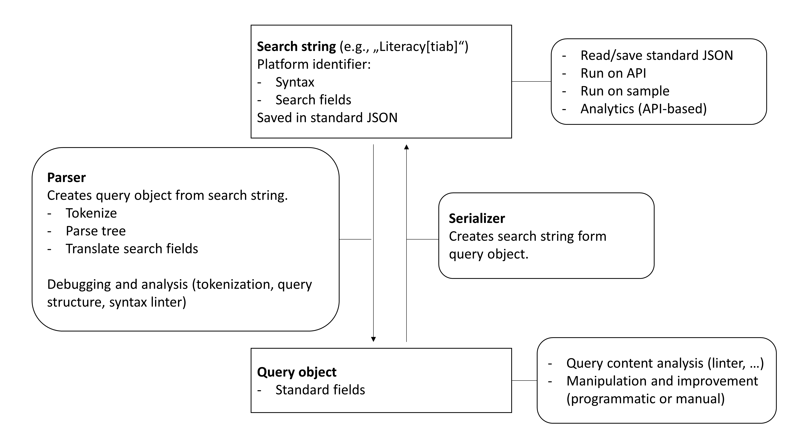

Search-Query Documentation
========================================

Search string
----------------

Search strings can be either in string or list format.

The standard JSON format is based on Haddaway et al. (2022).

Parser
----------------

See `dev-parser <dev_docs/parser.html>`_ docs.

Linter
----------------

See `dev-linter <dev_docs/linter.html>`_ docs.

Query object
----------------

Serializer
----------------

Tests
----------------

- All test data should be stored in standard JSON.

Development setup
-------------------

.. code-block::
   :caption: Installation in editable mode with `dev` extras

   pip install -e ".[dev]"

References
----------------

Haddaway, N. R., Rethlefsen, M. L., Davies, M., Glanville, J., McGowan, B., Nyhan, K., & Young, S. (2022). A suggested data structure for transparent and repeatable reporting of bibliographic searching. *Campbell Systematic Reviews*, 18(4), e1288. doi:`10.1002/cl2.1288 <https://onlinelibrary.wiley.com/doi/full/10.1002/cl2.1288>`_

.. toctree::
   :maxdepth: 2
   :caption: Contents:

   dev_docs/parser
   dev_docs/linter
