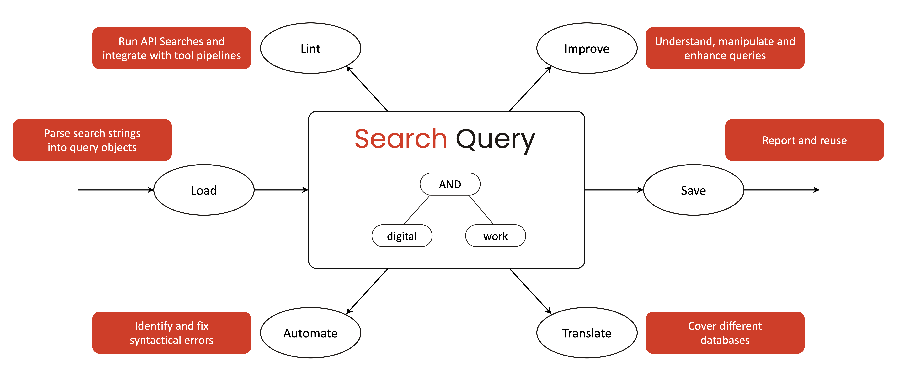

.. raw:: html

    <h1 style="display:none;">Search-Query Documentation</h1>

.. raw:: html

   

         

       
       
       
       
   

..
       

**Search Query** is a Python package designed to **load**, **lint**, **translate**, **save**, **improve**, and **automate** academic literature search queries.
It is extensible and currently supports PubMed, EBSCOHost, and Web of Science.
The package can be used programmatically, through the command line, or as a pre-commit hook.
It has zero dependencies and integrates in a variety of environments.
The parsers and linters are battle-tested on peer-reviewed `searchRxiv <https://www.cabidigitallibrary.org/journal/searchrxiv>`_ queries.

Installation
============

To install `search-query`, run:

.. code-block:: bash

    pip install search-query

Quickstart
================

Creating a query programmatically is simple:

.. code-block:: python

    from search_query import OrQuery, AndQuery

    # Typical building-blocks approach
    digital_synonyms = OrQuery(["digital", "virtual", "online"], search_field="Abstract")
    work_synonyms = OrQuery(["work", "labor", "service"], search_field="Abstract")
    query = AndQuery([digital_synonyms, work_synonyms], search_field="Author Keywords")

..
    Parameters:

    - list of strings or queries: strings that you want to include in the search query,
    - ``search_field``: search field to which the query should be applied (available options: TODO — provide examples and link to docs)
   Search strings can be either in string or list format.

We can also parse a query from a string or a `JSON search file <#json-search-files>`_ (see the :doc:`overview of platform identifiers </platforms/platform_index>`):

.. code-block:: python

    from search_query.parser import parse

    query_string = '("digital health"[Title/Abstract]) AND ("privacy"[Title/Abstract])'
    query = parse(query_string, platform="pubmed")

TODO : update the following:

Once we have created a :literal:`query` object, we can translate it for different databases.
Note how the syntax is translated and how the search for :literal:`Title/Abstract` is spit into two elements:

.. code-block:: python

    query.to_string(platform="ebsco")
   # Output:
   # (TI("digital health") OR AB("digital health")) AND (TI("privacy") OR AB("privacy"))

    query.to_string(platform="wos")
   # Output:
   # (TI=("digital health") OR AB=("digital health")) AND (TI=("privacy") OR AB=("privacy"))

Another useful feature of search-query is its **linter** functionality, which helps us to validate the query by identifying syntactical errors:

.. code-block:: python

    from search_query.parser import parse

    query_string = '("digital health"[Title/Abstract]) AND ("privacy"[Title/Abstract]'
    query = parse(query_string, platform="pubmed")
   # Output:
   # ❌ Fatal: unbalanced-parentheses (F1001)
   #    Unbalanced opening parenthesis
   #    ("digital health"[Title/Abstract]) AND ("privacy"[Title/Abstract]
   #                                          ^^^

..
   Beyond the instructive error message, additional information on the specific messages is available `here <messages/errors_index.html>`_.

    Each query parser has a corresponding linter that checks for errors and warnings in the query.
    To validate a JSON query file, run the linter:

    .. code-block:: python

        from search_query.linter import run_linter

        messages = run_linter(search.search_string, platform=search.platform)
        print(messages)

    There are two modes:

    - **Strict mode**: Forces the user to maintain clean, valid input but at the cost of convenience. This mode fails on fatal or error outcomes and prints warnings.
    - **Non-strict mode**: Focuses on usability, automatically resolving common issues while maintaining transparency via warnings. This mode fails only on fatal outcomes. Auto-corrects errors as much as possible and prints a message (adds a fatal message if this is not possible). Prints warnings.

    An additional "silent" option may be used to silence warnings.

Demo
============

A Jupyter Notebook demo (hosted on Binder) is available here:

.. image:: https://mybinder.org/badge_logo.svg
   :target: https://mybinder.org/v2/gh/CoLRev-Environment/search-query/HEAD?labpath=docs%2Fsource%2Fdemo.ipynb

Functional Overview
=======================

The search-query package is built to support researchers throughout the entire lifecycle of academic search query management.
Below is a high-level overview of the core functionalities:

..
   Parser development
   -------------------------

   To develop a parser, see `dev-parser <dev_docs/parser.html>`_ docs.

.. toctree::
   :hidden:
   :maxdepth: 3
   :caption: Contents:

.. toctree::
   :hidden:
   :maxdepth: 3
   :caption: Manual

   load
   lint/index
   translate
   save
   improve
   automate

.. toctree::
   :hidden:
   :maxdepth: 3
   :caption: Platforms

   platforms/platform_index

.. toctree::
   :hidden:
   :maxdepth: 3
   :caption: Interfaces

   cli
   pre_commit

.. toctree::
   :hidden:
   :maxdepth: 1
   :caption: Developer documentation

   dev_docs/overview
   dev_docs/parser_development
   dev_docs/linter_development
   dev_docs/translator_development
   dev_docs/tests
