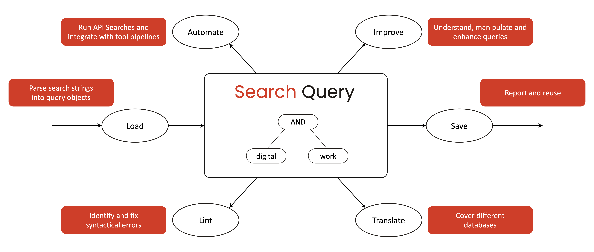
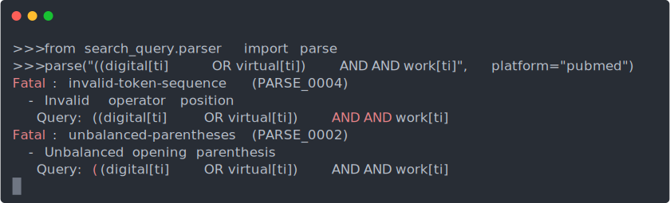
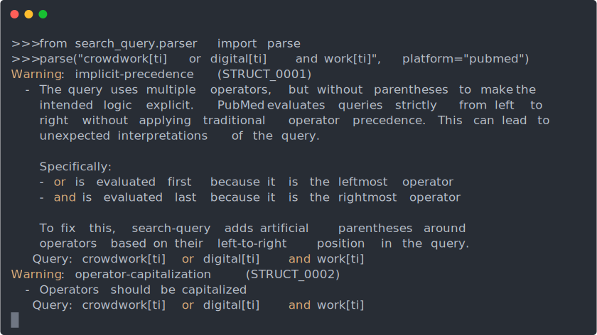
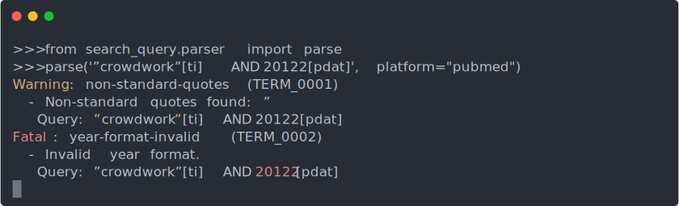
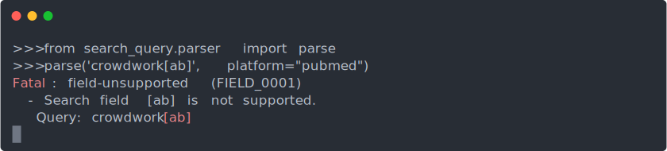
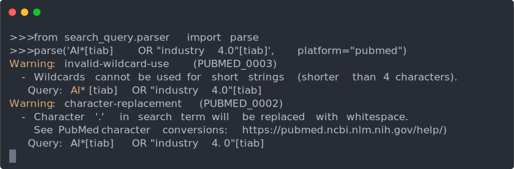
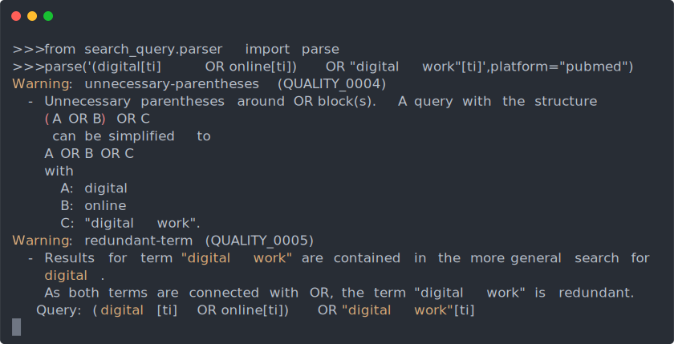

# Summary

*search-query* is an open source Python library for academic literature search queries.
Its core capabilities include linting to detect syntactic and logical errors, translation to convert queries across database-specific syntaxes, improvement to programmatically refine queries, and automation to integrate searches into reproducible workflows.
The library currently supports *Web of Science*, *PubMed*, and *EBSCOHost*, with parsers validated against a comprehensive set of peer-reviewed queries from *searchRxiv*.
Unlike existing proprietary and web-based software, *search-query* offers programmatic access and thereby supports integration into research workflows, contributing to the automation of systematic literature reviews.
<!-- By addressing key gaps in literature search tools, *search-query* contributes to the correctness and efficiency of systematic reviews and meta-analyses. -->

Keywords: Python, search query, literature search, literature review, meta-analysis.

<!-- 
- entry: enter queries from cli/programmatically
- manipulation: change query elements programmatically
- parsing: parse query (tree) object from different input formats
- formatting (translation): generate query strings in different syntax from query object
- analysis: retrieval size per sub-tree (Theis), syntactic analysis of contradiction
- simplification:
  - Stemming and Lemmatization: Reduce words to their root forms to capture all variants (e.g., "running" to "run")., Wildcards: Use symbols (e.g., ?, #) within words to replace a single character (e.g., "wom?n" retrieves "woman" and "women"), Truncation: Use a symbol (usually ) to replace one or more characters at the end of a word (e.g., "comput" retrieves "computer," "computing").
  - Combining terms: combining terms in queries like "run AND running" (absorption law), using wildcards to combine terms (if they have the same search-fields). 
  - Redundant Nesting: Remove unnecessary parentheses to simplify the query structure (associative property), remove unnecessary parentheses
-refinement (TBD): expansion based on synonyms and thesaurus terms
  - Synonym Expansion: Use a thesaurus or controlled vocabulary (like MeSH for medical terms) to expand queries with synonyms or related terms (see synonym-expansion-mesh.py)
- execution: api supercharging (-> pubmed) with capability to RESUME search (iterating over years?)

Planned:

- effectiveness: estimate retrieval performance based on a given sample
- sample extension: strategically extend the sample to improve accuracy of retrieval performance estimates

Properties: tested, extensible, open source

- A substantial percentage of peer-reviewed literature search queries has syntactical errors, ambiguities (??), and inconsistencies
- Existing tools do not sufficiently validate queries (often, it is unclear whether they were actually used)
- There are no tools to programmatically validate search queries

Existing libraries (like Jabref) rely on existing parsers for apache lucene (instead of implementing parsers that specifically match the syntax and errors of academic databases): https://jabref.readthedocs.io/en/latest/adr/0015-support-an-abstract-query-syntax-for-query-conversion/

https://link.springer.com/referenceworkentry/10.1007/978-0-387-39940-9_1070
"Given a source query Q s over a source schema and a target query template over a target schema, query translation generates a query that is semantically closest to the source query and syntactically valid to the target schema. The semantically closest is measured by a closeness metrics, typically defined by precision and/or recall of a translated query Versus a source query over a database content. Syntax validness indicates the answerability of a translated query over the target schema. Therefore, the goal of query translation is to find a query that is answerable over the target schema and meanwhile retrieves the closest set of results as the source query would retrieve over a database content."
- not directly applicable because database content differs by definition
- focus on retrieval performance does not refer to semantics at all?! (could be completely different selection of search terms?!)
-->

# Statement of Need

Researchers conducting meta-analyses and other types of literature reviews rely on database searches as the primary search technique [@Hiebl2023].
This involves the design of Boolean queries, the translation for specific databases, and the execution.
Requirements include:
(1) query translation, i.e., parsing a query in one database specific syntax and serializing it in another syntax [e.g., @AlZubidyCarver2019; @SturmSunyaev2019],
(2) query linting, i.e., identifying syntactical errors or warning of known database errors [e.g., @LiRainer2023; @SinghSingh2017],
(3) query improvement, i.e., manipulation of query objects to understand and enhance performance [e.g., @ScellsZucconKoopman2020], and
(4) automation, i.e., offering programmatic or API access to integrate with existing workflows [e.g., @BellerClarkTsafnatEtAl2018; @OConnorTsafnatGilbertEtAl2018].

# Overview of search-query capabilities

*search-query* treats queries as objects rather than static strings.
Query objects can be created programmatically or parsed from search strings, giving researchers access to the following capabilities (illustrated in Figure 1):

- **Load:** *search-query* provides parsing capabilities to ingest search queries from both raw strings and JSON files.
  It parses database-specific query strings into internal, object-oriented representations of nested queries consisting of operators, search terms, and field restrictions.
  Currently, parsers are available for *Web of Science*, *PubMed*, and *EBSCOHost*.
  The *load* capability is extensible, and the documentation outlines how to develop parsers for additional databases.

- **Save:** Researchers can serialize the query object back into a standard string or JSON file for reporting and reuse.
  <!-- In practice, this means that a query constructed or edited within the tool can be exported as a well-formatted search string that is ready to be executed in a database or included in the methods section of a paper. -->
  This facilitates transparency and reproducibility by allowing search strategies to be easily reported, shared or deposited.

- **Lint:** *search-query* includes linters to detect syntactical errors or inconsistencies that might compromise the search.
  It can check for issues such as unbalanced parentheses, logical operator misuse, or database-specific syntax errors.
  The validation rules are based on an analysis of a large corpus of real-world search strategies from the *searchRxiv* registry, revealing that many published queries still contained errors even after peer review.
  By identifying such problems early, linters can help researchers validate and refine queries before execution.
  The linting component can be extended to cover more databases and incorporate new messages, such as warnings for database-specific quirks.

- **Translate:** The library can convert a query from one database syntax into another, enabling cross-platform use of search strategies.
  Using a generic query object as an intermediate representation, *search-query* currently supports translations between  *Web of Science*, *PubMed*, and *EBSCOHost*.
  Such query translation capability can eliminate manual efforts for rewriting queries and reduce the risk of human error during translation.
  In line with the vision of seamless cross-database literature searches, future development will focus on adding more databases to the translation repertoire.

- **Improve:** Beyond basic syntax checking and translation, *search-query* aims to support query improvement to enhance recall and precision.
  When queries are represented as manipulable objects, researchers can programmatically experiment with modifications — for example, adding synonyms or adjusting field scopes — to observe how these changes affect the search results.
  In future work, this improvement capability may be augmented with more automated suggestions and optimizations.

- **Automate:** Automation primarily refers to the integration with systematic review management systems, such as CoLRev [@WagnerPrester2025].
  The library offers programmatic access via its Python API, which means it can be embedded in scripts and pipelines to run searches automatically.
  It also provides a command-line interface and pre-commit hooks (*Git*), allowing researchers to incorporate query validation into version control and continuous integration setups.
  <!-- By representing queries in the form of objects, *search-query* further enables advanced use cases such as executing searches on platforms that lack native Boolean query support, for instance, by breaking a complex query into multiple API calls. -->

{label="fig_overview" width="340pt"}

<!--
\begin{figure}[ht]
  \centering
  \includegraphics[width=\textwidth]{figure_1.png}
  \caption{Core functionality of the \textit{search-query} library}
  \label{fig:search_query}
\end{figure}
-->

# Example usage

<!-- [Documentation](https://colrev-environment.github.io/search-query/) -->

## Load

```python
# Option 1: Parse query file
from search_query.search_file import load_search_file

search_file = load_search_file("search-file.json")
wos_query = parse(search_file.search_string, platform=search_file.platform)

# Option 2: Parse query string
from search_query.parser import parse

wos_query = parse("digital AND work", platform="wos")

# Option 3: Construct query programmatically
from search_query import OrQuery, AndQuery

digital_synonyms = OrQuery(["digital", "virtual", "online"])
work_synonyms = OrQuery(["work", "labor", "service"])
query = AndQuery([digital_synonyms, work_synonyms], field="title")

# Option 4: Load query from database
from search_query.database import load_query

FT50_journals = load_query("journals_FT50")
```

## Save

When saving a query, the JSON format is based on the standard proposed by @HaddawayRethlefsenDaviesEtAl2022.

```python
from search_query import SearchFile

search_file = SearchFile(
   search_string=pubmed_query.to_string(),
   platform="pubmed",
   version="1",
   authors=[{"name": "Gerit Wagner"}],
   record_info={},
   date={}
)

search_file.save("search-file.json")
```

## Lint

The parser automatically emits linter messages that identify errors and provide suggestions for improvement.
This helps researchers maintain high-quality—even in complex search strategies.
In fact, search queries used in literature reviews are often long and complex:
Peer-reviewed queries from *searchRxiv*, for instance, average over 2,900 characters and include around 60 parentheses.
Such queries are difficult to analyze visually—both for researchers constructing them and for reviewers assessing their validity.
The linters identify six categories of errors, which are illustrated briefly in the following.

<!--
rm test.cast
asciinema rec test.cast
python
ctrl+l
from search_query.parser import parse
CODE
ctrl+d
# edit: replace machine path
# ~/ownCloud/data/2021-CoLRev/wip/asciinema
# ~/
# gerit@gerit-thinkpad
# user@machine
# remove last lines
# svg-term with adjusted from/height , add --at time (without dot)
# rename files at the end (parse.cast, parse.svg)


PARSE
parse("((digital[ti] OR virtual[ti]) AND AND work[ti]", platform="pubmed")
svg-term --in test.cast --out demo.svg --window --at 1288885 --height 9 --width 80

STRUCT
parse("crowdwork[ti] or digital[ti] and work[ti]", platform="pubmed")
svg-term --in test.cast --out demo.svg --window --at 1288885 --height 19 --width 80

TERM
parse('”crowdwork”[ti] AND 20122[pdat]', platform="pubmed")
svg-term --in test.cast --out demo.svg --window --at 9905396 --height 9 --width 80

FIELD
parse('crowdwork[ab]', platform="pubmed")
svg-term --in test.cast --out demo.svg --window --at 7578787 --height 6 --width 80

DATABASE
parse('AI*[tiab] OR "industry 4.0"[tiab]', platform="pubmed")
svg-term --in test.cast --out demo.svg --window --at 8093623 --height 10 --width 80

QUALITY
parse('(digital[ti] OR online[ti]) OR "digital work"[ti]', platform="pubmed")
svg-term --in test.cast --out demo.svg --window --at 9553798 --height 17 --width 80
-->

**Parsing errors** highlight critical syntax errors that prevent a query from being parsed.
Typical examples include unmatched parentheses, misplaced logical operators, or invalid token sequences.
These errors usually require correction before any further processing or database execution is possible.

{#fig:parse width="320pt"}

**Query structure errors** highlight errors that affect the validity or clarity of a query's logical structure, such as implicit operator precedence or inconsistent capitalization of Boolean operators.
These warnings help ensure that the intended logic is clear and that the query remains readable and easy to verify.

{#fig:struct width="320pt"}

**Term errors** identify suspicious or malformed search terms, such as non-standard quotes or invalid date formats.
These errors may cause databases to interpret the terms incorrectly or fail to return relevant results.

{#fig:term width="320pt"}

**Field errors** point to missing, implicit, or unsupported field tags.
These errors may lead to incorrect interpretations or cause the query to fail during execution in the database.

{#fig:field width="320pt"}

**Database errors** flag platform-specific quirks and limitations that may not be obvious to users.
These include constraints on wildcard usage, invalid characters, and limitations of proximity operators.
These errors can cause queries to execute incorrectly or fail, despite appearing syntactically valid.

{#fig:database width="320pt"}

**Best practice qualities** include recommendations for constructing effective search queries.
These include alerts about redundant terms, unnecessary parentheses or complex query structures.

{#fig:quality width="320pt"}

In addition, it is possible to access linter messages programmatically:

```python
from search_query.linter import lint_file

messages = lint_file(search_file)
```

## Translate

```python
query_string = '("dHealth"[Title/Abstract]) AND ("privacy"[Title/Abstract])'
pubmed_query = parse(query_string, platform="pubmed")
wos_query = pubmed_query.translate(target_syntax="wos")
print(wos_query.to_string())
# Output:
# (AB="dHealth" OR TI="dHealth") AND (AB="privacy" OR TI="privacy")
```

Capability to improve and automate search queries focuses on the programmatic use of *search-query* for custom logic and use cases (e.g., writing tailored functions).
As these features are designed for flexible integration into code-based workflows, it is hard to illustrate them through generic examples;
instead, guidance can be found in the [online documentation](https://colrev-environment.github.io/search-query/index.html).

\newpage

# Related software packages

<!-- 
Tools for academic (Boolean) literature search queries:

- *Yale MeSH Analyzer*: Organizes MeSH terms (keywords) for selected papers in a table for manual search query construction, [link](https://mesh.med.yale.edu/) [@GrossettaNardiniWang2023]
- *Polyglot search*: Free web interface to translate PubMed or Ovid MEDLINE search queries to seven other platforms, with color highlighting for warnings, [link](https://polyglot.sr-accelerator.com/) [@ClarkGlasziouDelMarEtAl2020a]
- *2DSearch*: Proprietary tool for drag-and-drop construction of Boolean search queries with corresponding numbers of search results, [link](https://www.2dsearch.com/) [@RussellRoseGoochWillittsEtAl2023]
- *LitSonar*: Meta-search engine to construct search queries and translate them to six platforms, and generate publication coverage reports, [link](https://litsonar.com/) [@SturmSunyaev2019]
- *Permusearch*: Free web interface (based on R) to determine the number of search results for different variations of a search query, [link](https://github.com/spzwanenburg/PermuSearch)
- *Publish or Perish*: Software to retrieve search results from different APIs (such as GoogleScholar), [link](https://harzing.com/resources/publish-or-perish) [@Harzing2022]
- *litsearchr*: R package supporting quasi-automatic search strategy development based on keyword co-occurrence analysis, [link](https://elizagrames.github.io/litsearchr/) [@Grames2020]
- *litbaskets*: Free web interface showing how many results are returned for a given query and different sets of journals, [link](https://litbaskets.io/)
- *PubVenn*: Displays a Venn diagram for search queries in PubMed, [link](https://pubvenn.appspot.com/) [@Sperr2020a]
- *Medline Transpose*: Free web interface to translate search strategies between Ovid MEDLINE and PubMEd, [link](https://medlinetranspose.github.io/) [@Unknown2018]
- *SensPrecOptimizer*: Software for developing highly sensitive search strategies by combining search queries, [link](https://github.com/mesgarpour/sens-prec-optimizer) [@UnknownNoYeary]

TODO:
https://ielab.io/searchrefiner/
https://github.com/netgen/query-translator 
https://guides.library.cornell.edu/evidence-synthesis/translate
  - Galach!?

We do not cover citation search, citation recommender systems such as Litmaps, or GScraper.

Table: Overview of related tools

| Category                  | Tool                                                                               |
|---------------------------|------------------------------------------------------------------------------------|
| Construction and analysis | litsearchr, Yale MeSH Analyzer, 2DSearch, litbaskets, PubVenn, SensPrecOptimizer\* |
| Translation               | Polyglot search, LitSonar, Medline Transpose                                       |
| Validation                | Polyglot search                                                                    |
| Execution                 | Permusearch, Publish or Perish                                                     |

-->

Table 1 provides an overview of related software packages and a comparison with *search-query*.
The leading query translators, *Polyglot search* and *Litsonar*, are proprietary and delivered through websites, i.e., without integration capabilities. 
<!-- Litsonar: no parser -->
*Polyglot search* supports a more comprehensive selection of databases (15) and initial validation hints [@ClarkGlasziouDelMarEtAl2020a].
*Litsonar* supports seven databases, but does not offer parsers [@SturmSunyaev2019].
As software packages available under open source licenses,
*Medline Transpose* [@WannerBaumann2019] is a JavaScript-based website that translates queries between three databases,
and *litsearchr* [@Grames2020] is an R library that supports semi-automated generation of queries based on text-mining techniques.
<!-- https://github.com/MedlineTranspose/medlinetranspose.github.io/blob/master/transpose2EP.html -->

\begin{table}[ht]
    \centering
    \begin{tabular}{lllccccccc}
            Software package
             & Setup 
             & License 
             & \rotatebox{80}{Load} 
             & \rotatebox{80}{Save}
             & \rotatebox{80}{Lint} 
             & \rotatebox{80}{Translate} 
             & \rotatebox{80}{Improve}
             & \rotatebox{80}{Automate}
             \\
        \hline
        % Yale MeSH Analyzer & $\bullet$ &  &  &  &  &  \\
        % 2DSearch & $\bullet$ &  & &  & & \\
        % Permusearch & & & & & & \\
        % Publish or Perish & &  &  & & & \\
        % litbaskets &  &  & & & & \\
        % PubVenn &  &  & & & & \\
        % SensPrecOptimizer & & &  &  & & \\
        Polyglot search   & Website   & Proprietary & $\bigcirc$  & $\bullet$ & $\bigcirc$ & $\bullet$ &  -         & $\bigcirc$ \\
        LitSonar          & Website   & Proprietary & $\bigcirc$  & $\bullet$ & -          & $\bullet$ &  -         & $\bigcirc$ \\
        Medline Transpose & Website   & MIT         & $\bigcirc$  & $\bullet$ & -          & $\bullet$ &  -         & $\bigcirc$ \\
        litsearchr        & R library & GPL-3       & $\bigcirc$  & $\bullet$ & -          & -         &  $\bullet$ & $\bullet$  \\
        search-query      & Python    & MIT         & $\bullet$   & $\bullet$ & $\bullet$  & $\bullet$ &  $\bullet$ & $\bullet$  \\
        \hline
    \end{tabular}
    \caption{Overview of related software packages (- no support, $\bigcirc$ limited support, $\bullet$ support)}
    \label{tab:query_tools}
\end{table}

In comparison to related software packages, *search-query* provides a Python library, released under the MIT open source license.
It is extensible and currently supports three databases (*Web of Science*, *PubMed*, *EBSCOHost*) for query translation and query validation.
The query parsers were tested with a comprehensive selection of peer-reviewed queries from *[searchRxiv](https://www.cabidigitallibrary.org/journal/searchrxiv)* [@White2024].
Testing showed that a significant number of queries still contained errors after passing the peer-review process, further highlighting the need for linters like *search-query*.

<!-- 
Given that *search-query* is designed for programmatic access, it can serve as a basis for query improvement and can be integrated into existing tool pipelines [@BellerClarkTsafnatEtAl2018].

There is no tool supporting programmatic access (integration with other tools).
Linting is only supported by one tool (Polyglot search) to a limited degree.
Existing tools for search query translation have limited coverage (of databases), errors (**todo. examples**), and many are not actively maintained.
Integration: manual (error-prone/efforts) copy/paste

This coincides with limitations mentioned in recent methods papers [@LiRainer2022; @SinghSingh2017] -->

## Acknowledgments and outlook

The development of *search-query* originated from a series of student thesis projects at the Digital Work Lab, Otto-Friedrich-Universität Bamberg [@fleischmann2025; @gessler2025; @schnickmann2025; @eckhardt2025; @ernst2024].
Looking forward, we envision *search-query* growing through both community and academic contributions.
The developer documentation provides guidance on extending the library, for example, adding support for new databases or custom linter rules.
Our goal is to build an open platform and continually expand *search-query*’s capabilities in line with the needs of researchers working on literature review projects.

# References
